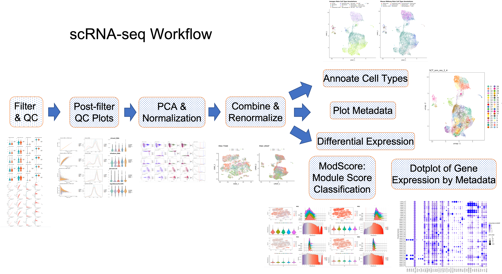

# SCWorkflow

Workflow Package for Analysis of Single Cell Data

The Single Cell Workflow streamlines the analysis of multimodal Single Cell RNA-Seq data produced from 10x Genomics.  It can be run in a docker container, and for biologists, in user-friendly web-based interactive notebooks (NIDAP, Palantir Foundry). Much of it is based on the Seurat workflow in Bioconductor, and supports CITE-Seq data.  It incorporates a cell identification step (ModScore) that utilizes module scores obtained from Seurat and also includes Harmony for batch correction.

Some of the steps in the workflow:

Future Developments include addition of support for multiomics (TCR-Seq, ATAC-Seq) single cell data and integration with spatial transcriptomics data.

