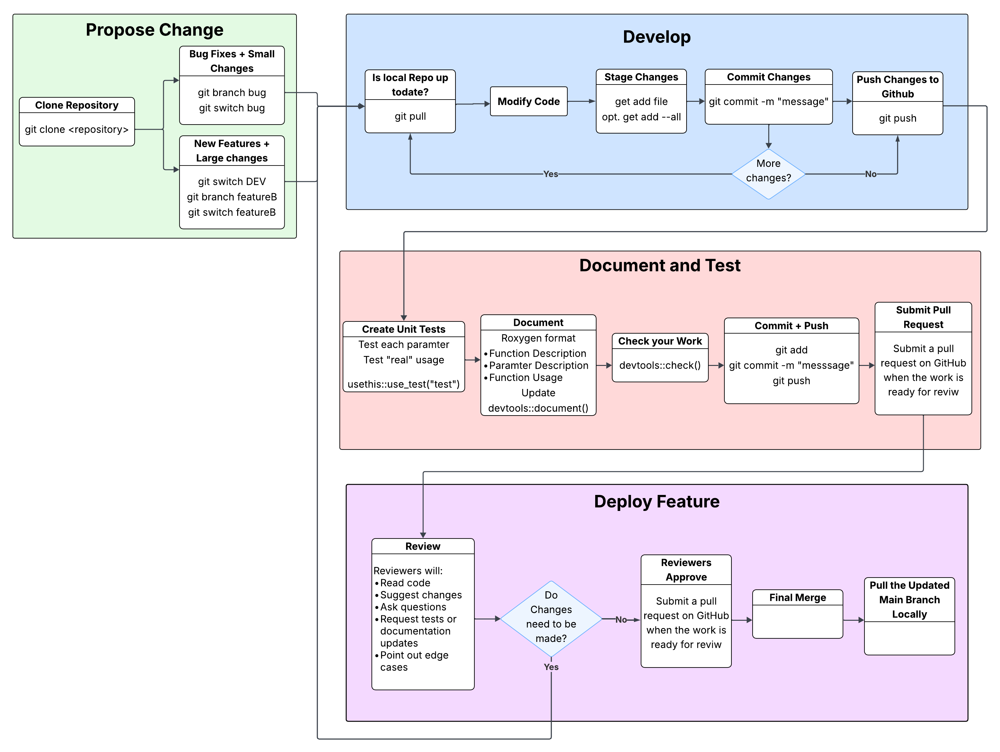

```{r, include = FALSE}
options(rmarkdown.html_vignette.check_title = FALSE)

knitr::opts_chunk$set(
  collapse = TRUE,
  comment = "#>",
  warning = FALSE, message = FALSE
)


run_Chunks=FALSE
```

# Overview {#overview}

{}

<br>

# **Propose Change** {#propose-changes}

---


## **Clone the repo** {#clone-the-repo}

If you are a member of [CCBR](https://github.com/CCBR),
you can clone this repository to your computer or development environment.

<br>

SCWorkflow is a large repository so this may take a few minutes. 

```sh
git clone --single-branch --branch DEV https://github.com/NIDAP-Community/SCWorkflow.git
```

> Cloning into 'SCWorkflow'... <br>
> remote: Enumerating objects: 3126, done. <br>
> remote: Counting objects: 100% (734/734), done. <br>
> remote: Compressing objects: 100% (191/191), done. <br>
> remote: Total 3126 (delta 630), reused 545 (delta 543), pack-reused 2392 (from 1) <br>
> Receiving objects: 100% (3126/3126), 1.04 GiB | 4.99 MiB/s, done. <br>
> Resolving deltas: 100% (1754/1754), done. <br>
> Updating files: 100% (306/306), done. <br>

```sh
cd SCWorkflow
```

<br> 

## **Install dependencies** {#install-dependencies}

If this is your first time cloning the repo you may have to install dependencies

<!-- **Steps to follow:** -->

**Check R CMD:** In an R console, make sure the package passes R CMD check by running:
```r
   devtools::check()
```
   > ⚠️ **Note:** If R CMD check doesn't pass cleanly, it's a good idea to ask for help before continuing.

<!-- - Install [`pre-commit`](https://pre-commit.com/#install) if you don't already
  have it. Then from the repo's root directory, run

```sh
  pre-commit install
```

  This will install the repo's pre-commit hooks.
  You'll only need to do this step the first time you clone the repo. -->

<br>

## **Load SCWorkflow from repo** {#load-scworkflow}

In an R console, load the package from the local repo using: 

```r
devtools::load_all()
```

<br>

## **Create branch** {#create-branch}

Create a Git branch for your pull request (PR). Give the branch a descriptive name for the changes you will make.

**Example:** Use `iss-10` if it's for a specific issue, or `feature-new-plot` for a new feature.

For bug fixes or small changes, you can branch from the `main` branch.

```sh
# Create a new branch from main and switch to it
git branch iss-10
git switch iss-10
```
> **Success:** Switched to a new branch 'iss-10'

For new features or larger changes, branch from the `DEV` branch.

```sh
# Switch to DEV branch, create a new branch, and switch to new branch
git switch DEV
git branch feature-new-plot
git switch feature-new-plot
```
> **Success:** Switched to a new branch 'feature-new-plot'

<br><br>

# Develop {#develop}

---

## **Make your changes** {#make-changes}

Now you're ready to edit the code, write unit tests, and update the documentation as needed.

<br>

### **Code Style Guidelines**


New code should follow the general guidelines outlined [here](https://nih.sharepoint.com/sites/NCI-CCR-CCBR-NIDAP/SitePages/R-Package-Coding-Style-and-Best-Practices.aspx).
- **Important:** Don't restyle code unrelated to your PR

**Tools to help:**
- Use the [styler](https://CRAN.R-project.org/package=styler) package to apply these styles


   **Key conventions from the [tidyverse style guide](https://style.tidyverse.org):**

   | Element | Style | Example |
   |---------|-------|----------|
   | Variables | snake_case | `my_variable` |
   | Functions | verbs in camelCase | `processData()` |
   | Assignment | `<-` operator | `x <- 5` |
   | Operations | pipes | `data %>% filter() %>% mutate()` |

<br> 

### **Function Organization**

**Structure your functions like this:**

Functions should follow this template. Use [roxygen2](https://cran.r-project.org/package=roxygen2) for documentation:

```r
#' @title Function Title
#' @description Brief description of what the function does
#' @param param1 Description of first parameter
#' @param param2 Description of second parameter
#' @details Additional details if needed
#' @importFrom package function_name
#' @export
#' @return Description of what the function returns

yourFunction <- function(param1, param2) {
  
  ## --------- ##
  ## Functions ##
  ## --------- ##
  
  ## --------------- ##
  ## Main Code Block ##
  ## --------------- ##
  
  output_list <- list(
    object = SeuratObject,
    plots = list(
      'plotTitle1' = p1,
      'plotTitle2' = p2
    ),
    data = list(
      'dataframeTitle' = df1
    )
  )
  
  return(output_list)
}
```
<br>


## **Commit and Push Your Changes** {#commit-push}


**Best practices for commits:**

We recommend following the **"atomic commits"** principle where each commit contains one new feature, fix, or task.

**Learn more:** [Atomic Commits Guide](https://www.freshconsulting.com/insights/blog/atomic-commits/)

<br>

## **Step-by-Step Process:**


### 1️⃣ **Check Status**
Check the current state of your Git working directory and staging area:

```sh
    git status
```

### 2️⃣ **Stage Files**
Add the files that you changed to the staging area:

```sh
    git add path/to/changed/files/
```

### 3️⃣ **Make the Commit**

```sh
    git commit -m 'feat: create function for awesome feature'
```

Your commit message should follow the
[Conventional Commits](https://www.conventionalcommits.org/en/v1.0.0/)
specification.
Briefly, each commit should start with one of the approved types such as
`feat`, `fix`, `docs`, etc. followed by a description of the commit.
Take a look at the [Conventional Commits specification](https://www.conventionalcommits.org/en/v1.0.0/#summary)
for more detailed information about how to write commit messages.

<!-- pre-commit will enforce that your commit message and the code changes are
styled correctly and will attempt to make corrections if needed.

> Check for added large files..............................................Passed <br>
> Fix End of Files.........................................................Passed <br>
> Trim Trailing Whitespace.................................................Failed <br>
> - hook id: trailing-whitespace <br>
> - exit code: 1 <br>
> - files were modified by this hook <br>
> <br>
> Fixing path/to/changed/files/file.txt <br>
> <br>
> codespell................................................................Passed <br>
> style-files..........................................(no files to check)Skipped <br>
> readme-rmd-rendered..................................(no files to check)Skipped <br>
> use-tidy-description.................................(no files to check)Skipped <br>

In the example above, one of the hooks modified a file in the proposed commit,
so the pre-commit check failed. You can run `git diff` to see the changes that
pre-commit made and `git status` to see which files were modified. To proceed
with the commit, re-add the modified file(s) and re-run the commit command:

```sh
git add path/to/changed/files/file.txt
git commit -m 'feat: create function for awesome feature'
```

This time, all the hooks either passed or were skipped
(e.g. hooks that only run on R code will not run if no R files were
committed).
When the pre-commit check is successful, the usual commit success message
will appear after the pre-commit messages showing that the commit was created.

> Check for added large files..............................................Passed <br>
> Fix End of Files.........................................................Passed <br>
> Trim Trailing Whitespace.................................................Passed <br>
> codespell................................................................Passed <br>
> style-files..........................................(no files to check)Skipped <br>
> readme-rmd-rendered..................................(no files to check)Skipped <br>
> use-tidy-description.................................(no files to check)Skipped <br>
> Conventional Commit......................................................Passed <br>
> [iss-10 9ff256e] feat: create function for awesome feature <br>
> 1 file changed, 22 insertions(+), 3 deletions(-) <br> -->

### 4️⃣ **Push your changes to GitHub:**

 ```sh
    git push
 ```

If this is the first time you are pushing this branch, you may have to
explicitly set the upstream branch:

 ```sh
    git push --set-upstream origin iss-10
 ```

We recommend pushing your commits often so they will be backed up on GitHub.
You can view the files in your branch on GitHub at
`https://github.com/NIDAP-Community/SCWorkflow/tree/<your-branch-name>`
(replace `<your-branch-name>` with the actual name of your branch).

<br><br>


# Document and Tests {#docs-tests}

---

## **Writing Tests**

**Why tests matter:** Most changes to the code will also need unit tests to demonstrate that the changes work as intended.

**How to add tests:**

1. Use [`testthat`](https://testthat.r-lib.org/) to create your unit tests
2. Follow the organization described in the [tidyverse test style guide](https://style.tidyverse.org/tests.html)
3. Look at existing code in this package for examples

<br>

## **Documentation**

**When to update documentation:**

- Written a new function
- Changed the API of an existing function
- Function is used in a vignette

**How to update documentation:**

1. Use [roxygen2](https://cran.r-project.org/package=roxygen2) with [Markdown syntax](https://roxygen2.r-lib.org/articles/rd-formatting.html)
2. See the [R Packages book](https://r-pkgs.org/man.html) for detailed instructions
3. Update relevant vignettes if needed

<br>

## **Check Your Work** {#check}

🔍 **Final validation step:**

After making your changes, run the following command from an R console to make sure the package still passes R CMD check:

```r
devtools::check()
```

> **Goal:** All checks should pass with no errors, warnings, or notes.

<br><br>

# **Deploy Feature** {#deploy-feature}

---

## 1️⃣ **Create the PR**

   Once your branch is ready, create a PR on GitHub:
   <https://github.com/NIDAP-Community/SCWorkflow/pull/new/>

   Select the branch you just pushed:

   

   Edit the PR title and description.
   The title should briefly describe the change.
   Follow the comments in the template to fill out the body of the PR, and
   you can delete the comments (everything between `<!--` and `-->`) as you go.
   When you're ready, click 'Create pull request' to open it.

   

   Optionally, you can mark the PR as a draft if you're not yet ready for it to
   be reviewed, then change it later when you're ready.

## 2️⃣ **Wait for a maintainer to review your PR**


   We will do our best to follow the tidyverse code review principles:
   <https://code-review.tidyverse.org/>.
   The reviewer may suggest that you make changes before accepting your PR in
   order to improve the code quality or style.
   If that's the case, continue to make changes in your branch and push them to
   GitHub, and they will appear in the PR.

   Once the PR is approved, the maintainer will merge it and the issue(s) the PR
   links will close automatically.
   Congratulations and thank you for your contribution!

## 3️⃣ **After your PR has been merged**

   After your PR has been merged, update your local clone of the repo by
   switching to the DEV branch and pulling the latest changes:

```sh
   git checkout DEV
   git pull
```

   It's a good idea to run `git pull` before creating a new branch so it will
   start from the most recent commits in main.

<br><br>

# **Helpful links for more information**

- This contributing guide was adapted from the [tidyverse contributing guide](https://github.com/tidyverse/tidyverse/blob/main/.github/CONTRIBUTING.md)
- [GitHub Flow](https://docs.github.com/en/get-started/using-github/github-flow)
- [tidyverse style guide](https://style.tidyverse.org)
- [tidyverse code review principles](https://code-review.tidyverse.org)
- [reproducible examples](https://www.tidyverse.org/help/#reprex)
- [R packages book](https://r-pkgs.org/)
- packages:
  - [usethis](https://usethis.r-lib.org/)
  - [devtools](https://devtools.r-lib.org/)
  - [testthat](https://testthat.r-lib.org/)
  - [styler](https://styler.r-lib.org/)
  - [roxygen2](https://roxygen2.r-lib.org)
