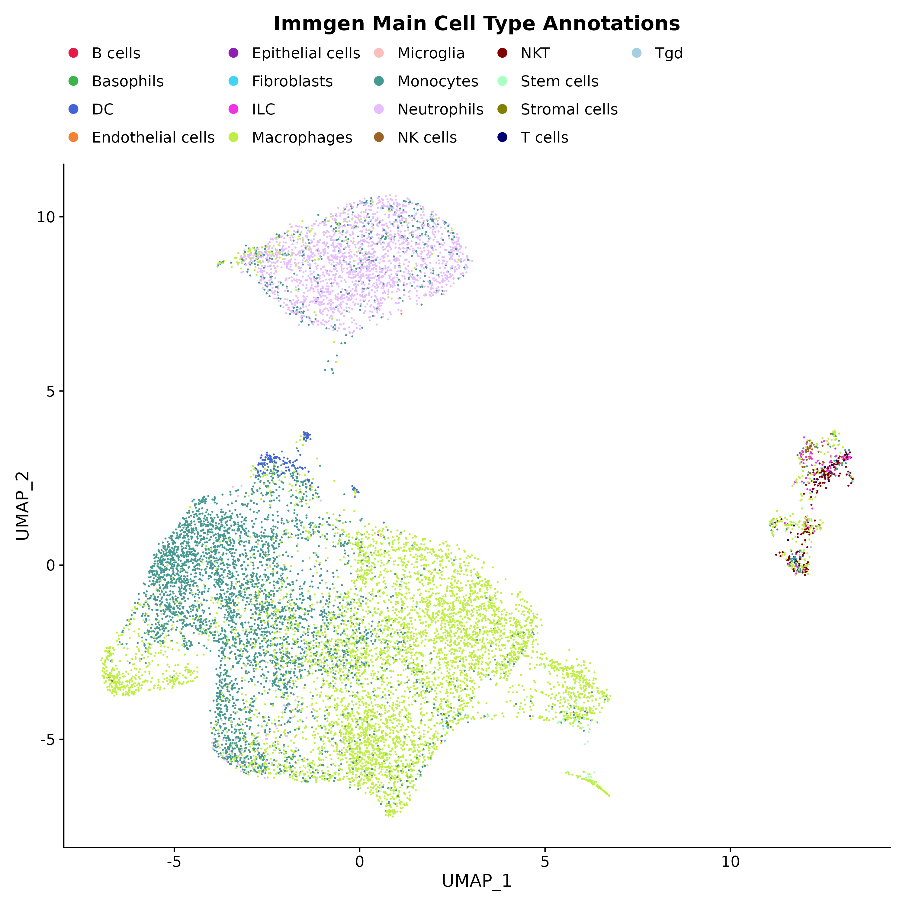
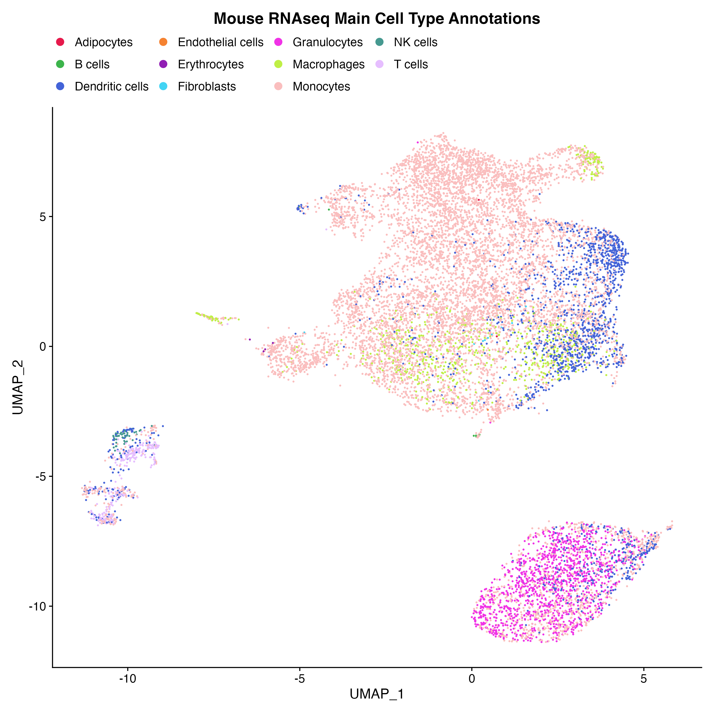
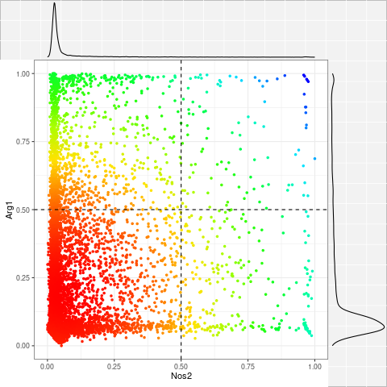
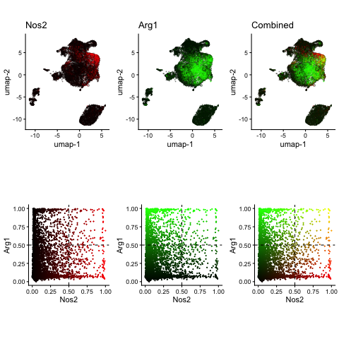
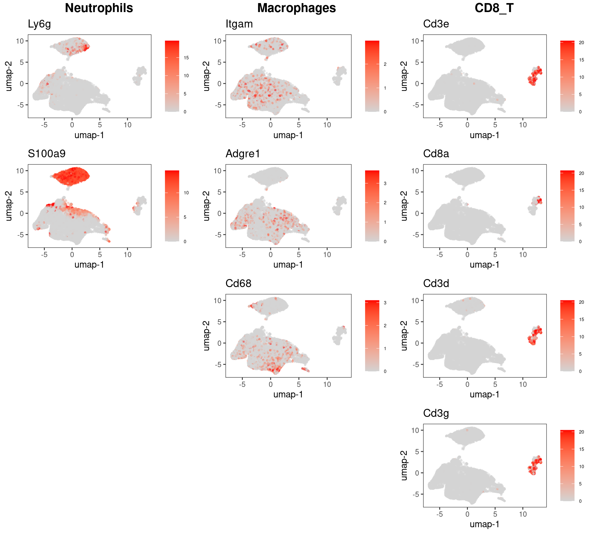
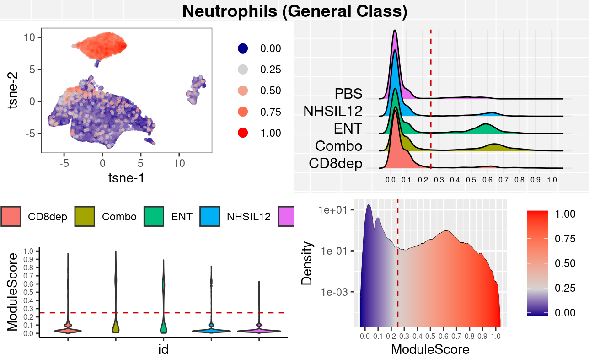
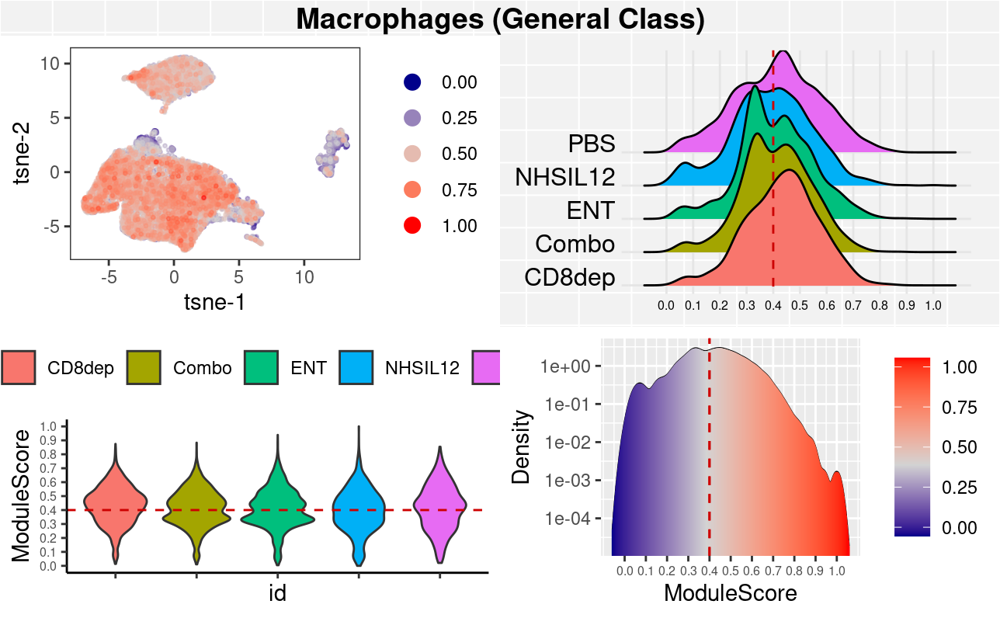
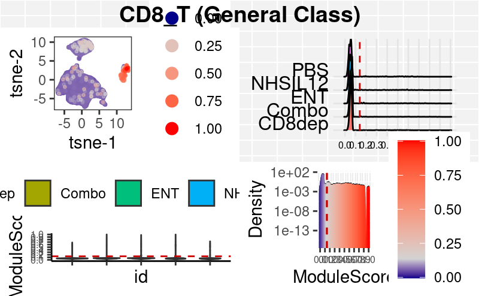
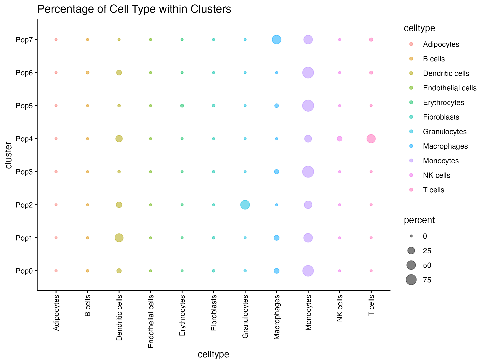
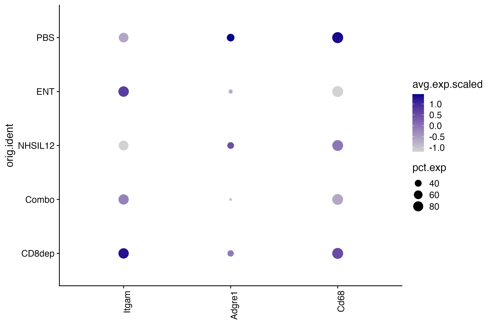

```{r, include = FALSE}
options(rmarkdown.html_vignette.check_title = FALSE)

knitr::opts_chunk$set(
  collapse = TRUE,
  comment = "#>",
  warning = FALSE, message = FALSE
)

library(data.table)
library(dplyr)
library(ggplot2)
library(tibble)

run_Chunks=FALSE
```

```{r,include=F,echo=F,eval=run_Chunks}
Comb_SO=list()
Comb_SO$object=readRDS("./images/CN_SO.rds")

```

<br>

## Cell Type Annotation with SingleR

This function automates cell type annotation in single-cell RNA sequencing data by employing the *SingleR* [1] method, which allocates labels to cells within a dataset according to their gene expression profile similarities with a reference dataset containing cell type labeled samples

SingleR is an automatic annotation method for single-cell RNA sequencing data that uses a given reference dataset of samples (single-cell or bulk) with known labels to label new cells from a test dataset based on similarity to the reference. Two mouse reference datasets (MouseRNAseqData and ImmGenData) and two human reference datasets (HumanPrimaryCellAtlasData and BlueprintEncodeData) from CellDex R package [2] are currently available.


```{r,eval=run_Chunks}
Anno_SO=annotateCellTypes(object=Comb_SO$object,
                  species = "Mouse",
                  reduction.type = "umap",
                  legend.dot.size = 2,
                  do.finetuning = FALSE,
                  local.celldex = NULL,
                  use.clusters = NULL)
```


```{r,echo=F,eval=run_Chunks}
saveRDS(Anno_SO, file="./images/Anno_SO.rds")

ggsave(Anno_SO$p1, filename = "./images/Anno1.png", width = 10, height = 10)
ggsave(Anno_SO$p2, filename = "./images/Anno2.png", width = 10, height = 10)

```

{width=300} {width=300}


<br>

## Add External Cell Annotations

This function will merge an external table of cell annotations into an existing Seurat Object's metadata table. The input external metadata table must have a column named "Barcode" that contains barcodes matching those found in the metadata already present in the input Seurat Object. The output will be a new Seurat Object with metadata that now includes the additional columns from the external table.


```{r,echo=F}
if (run_Chunks){
Anno_SO=readRDS("./images/Anno_SO.rds")


Anno_SO$object@meta.data[,'mouseRNAseq_main',drop=F]%>%rename('Cell Type'=mouseRNAseq_main)%>%rownames_to_column('Barcode')%>%
  write.table("PerCell_Metadata.csv",sep=",",row.names=F,quote=F)
}else {

   CellType_Anno_Table=read.csv("PerCell_Metadata.csv")

}

CellType_Anno_Table%>%head()%>% knitr::kable()

```

```{r,eval=run_Chunks,echo=T}

```

```{r,eval=run_Chunks,echo=F}


AddExternalAnnotation = function(
    seurat_object = SingleRCellTypes_SO,
    external_metadata = BRCA_Training_PerCell_Metadata,
    seurat_object_filename = "seurat_object.rds",
    barcode_column = "Barcode",
    external_cols_to_add = c("Patient","Celltype_Major","Celltype_Minor","Celltype_Subset"),
    col_to_viz = "Celltype_Major") {
    
## --------- ##
## Libraries ##
## --------- ##

# Load necessary libraries
# library(nidapfunctions)
# nidapLoadPackages(c("SCWorkflow", "magrittr", "tibble", "dplyr", "Seurat"))

## -------------------------------- ##
## User-Defined Template Parameters ##
## -------------------------------- ##

object <- SingleRCellTypes_SO
external_metadata <- BRCA_Training_PerCell_Metadata
seurat_object_filename <- "seurat_object.rds"
barcode_column = "Barcode"
external_cols_to_add = c("Patient","Celltype_Major","Celltype_Minor","Celltype_Subset")
col_to_viz = "Celltype_Major"

## -------------------------------- ##
## Errors                           ##
## -------------------------------- ##

## -------------------------------- ##
## functions                        ##
## -------------------------------- ##

## --------------- ##
## Main Code Block ##
## --------------- ##

# Load Seurat Object
cat(sprintf("\nReading Seurat Object from dataset: %s\n\n", paste(seurat_object_filename, collapse = ", ")))
path <- nidapGetPath(seurat_object, seurat_object_filename)
so <- readRDS(path)
print(so)

# Extract meta.data from Seurat Object
cat("Extracting Metadata Table from Seurat Object\n\n")
if ("meta.data" %in% slotNames(so)) {
  met.df <- so@meta.data
} else if ("RNA" %in% slotNames(so)) {
  met.df <- so$RNA@meta.data
} else {
  stop("No recognizable meta.data found in the Seurat object.")
}

# If no "Barcode" column exists, create it from rownames
if (!("Barcode" %in% colnames(met.df))) {
  met.df <- met.df %>% rownames_to_column("Barcode")
}

# Check if the user-specified barcode column exists
if (!(barcode_column %in% colnames(external_metadata))) {
    stop(paste("External metadata does not have the specified barcode column:", barcode_column))
}

# Parse external columns to add
if (!is.null(external_cols_to_add)) {
    cols_to_import <- trimws(unlist(strsplit(external_cols_to_add, ",")))
  
    # Always include Barcode in the subset
    cols_to_keep <- unique(c(barcode_column, cols_to_import))
    
    # Ensure all requested columns exist in external_metadata
    missing_cols <- setdiff(cols_to_keep, colnames(external_metadata))
    if (length(missing_cols) > 0) {
        stop(paste("These columns were not found in external_metadata:", paste(missing_cols, collapse = ", ")))
    }
  
    # Subset external_metadata to keep only the requested columns
    external_metadata <- external_metadata[, cols_to_keep, drop = FALSE]
}

# Merge the external metadata table with the Seurat object metadata by barcode
merged_metadata <- merge(met.df, external_metadata, by.x = "Barcode", by.y = barcode_column, all.x = TRUE)

## troubleshooting, check if any NULL rows appear in merged meta
if (any(is.na(merged_metadata$Barcode))){
    stop("STOP: Metadata not correctly merged. NA's produced.")
}
if (nrow(met.df)!=nrow(merged_metadata)){
    stop("STOP: Metadata not correctly merged. Incorrect number of rows when merged.")
}
if(length(setdiff(met.df$Barcode, external_metadata[[barcode_column]]))>0){
    warning("Warning: Not all cells from the Seurat Object are in the External Metadata table.")
}
if(length(setdiff(external_metadata[[barcode_column]], met.df$Barcode))>0){
    warning("Warning: Some cells in the External Metadata are not found in the Seurat Object.")
}

# Print or save the merged metadata for review
cat("Metadata successfully merged. Here is a preview:\n")
print(head(merged_metadata))

# Ensure that rownames in merged_metadata are barcodes, not numbers 
merged_metadata=column_to_rownames(merged_metadata,'Barcode')

# Update Seurat object with the new merged metadata
so <- AddMetaData(so, merged_metadata)

# If col_to_viz isn't empty, print TSNE/UMAP colored by this column.
if(length(col_to_viz) != 0) {
    print(DimPlot(so, group.by = col_to_viz, label = FALSE, reduction = 'umap'))# + NoLegend()
    print(DimPlot(so, group.by = col_to_viz, label = FALSE, reduction = 'tsne'))# + NoLegend()
}

output <- new.output()
output_fs <- output$fileSystem()
saveRDS(so, output_fs$get_path("seurat_object.rds", 'w'))

return(NULL)

}


```

```{r,eval=run_Chunks,echo=T}

ExtAnno_SO=ExternalAnnotation(object = Anno_SO$object,
                    external_metadata = CellType_Anno_Table,
                    seurat_object_filename = "seurat_object.rds",
                    barcode_column = "Barcode",
                    external_cols_to_add = c("Cell Type"),
                    col_to_viz = "Cell Type"
                   )

```

<br>

## Cell Annotation with Co-Expression

This function will display co-expression of two chosen markers in your Seurat Object. It will then Create a metadata column containing annotations for cells that correspond to the marker expression thresholds you set.

This function enables users to visualize the association between two selected genes or proteins according to their expression values in various samples. The association is plotted, and samples with values above or below a specified limit can be excluded. Users have the ability to customize the visualization, including the choice of visualization type, point size and shape, and transparency level.

Furthermore, the tool allows for the application of filters to the data, setting thresholds, and providing annotations to notify users if cells meet the established thresholds. The visualization can be improved by omitting extreme values. The tool also facilitates the creation of a heatmap to represent the density distribution of cells and exhibit the raw gene/protein expression values.

```{r,eval=run_Chunks,echo=T,results='hide'}
grep('Cd4',rownames(Anno_SO$object@assays$RNA),ignore.case = T,value=T)

DLAnno_SO=dualLabeling(object = Anno_SO$object, 
                        samples <- c("PBS","CD8dep","ENT","NHSIL12","Combo"), 
                        marker.1="Nos2", 
                        marker.2="Arg1", 
                        marker.1.type = "SCT", 
                        marker.2.type = "SCT", 
                        data.reduction = "both", 
                        point.size = 0.5, 
                        point.shape = 16, 
                        point.transparency = 0.5, 
                        add.marker.thresholds = TRUE, 
                        marker.1.threshold = 0.5, 
                        marker.2.threshold = 0.5, 
                        filter.data = TRUE, 
                        marker.1.filter.direction = "greater than", 
                        marker.2.filter.direction = "greater than", 
                        apply.filter.1 = TRUE, 
                        apply.filter.2 = TRUE, 
                        filter.condition = TRUE, 
                        parameter.name = "My_CoExp", 
                        trim.marker.1 = FALSE, 
                        trim.marker.2 = FALSE, 
                        pre.scale.trim = 0.99, 
                        display.unscaled.values = FALSE
                       )

plot(DLAnno_SO$plot_densityHM)
plot(DLAnno_SO$plot_umap)
```

```{r,echo=F,eval=run_Chunks}
png(filename="./images/DL1.png")
plot(DLAnno_SO$plot_densityHM)
dev.off()
png(filename="./images/DL2.png")
plot(DLAnno_SO$plot_umap)
dev.off()


```
{width=300} {width=300}

<br>

## Color by Gene Lists

This function generates plots to visualize the expression of specific markers (genes) in single-cell RNA sequencing (scRNA-seq) data. Gene plots are generated in the same order as  they appear in the input list (provided that they are present in the data).

This function takes in a number of inputs to create detailed plots showing the activity of certain genes. You can customize these based on specific samples or genes of interest or point transparency. 
The code has a built-in system to alert you if there are any issues with your chosen inputs. If a particular gene is missing, it will return an empty plot. If the gene is present, it will perform several steps to adjust the data for better visualization and analysis, such as normalizing the data and creating a reduction plot (a type of plot that helps visualize complex data).
The code also makes sure to display your chosen samples, creates a caption for the plot indicating which samples are shown, colors the points based on gene activity levels, and adjusts the plot's visual elements like transparency, size, and labels. 
If you haven't selected specific samples, it will use all the available samples from your data. It also checks for the presence of your chosen genes in the data and processes them to ensure uniformity across different cell types.
The output of this function is a detailed figure showing the activity of chosen genes across different cell types. This is useful for identifying distinct groups of cells based on gene activity levels.

```{r,eval=run_Chunks}
Marker_Table <- read.csv("Marker_Table_demo.csv")
```

```{r,eval=run_Chunks,echo=F}
Marker_Table_demo <- read.csv("../tests/testthat/fixtures/Marker_Table_demo.csv")
Marker_Table_demo%>%head()%>%
  knitr::kable()

Marker_Table=Marker_Table_demo[1:4,]
```

```{r,eval=run_Chunks,echo=T,results='hide'}
    
FigOut=colorByMarkerTable(object=Anno_SO$object,
                   samples.subset=c("PBS","ENT","NHSIL12", "Combo","CD8dep" ),
                   samples.to.display=c("PBS","ENT","NHSIL12", "Combo","CD8dep" ),
                   marker.table=Marker_Table,
                   cells.of.interest=c("Macrophages","M1","M2" ),
                   protein.presence = FALSE,
                   assay = "SCT",
                   reduction.type = "umap",
                   point.transparency = 0.5,
                   point.shape = 16,
                   cite.seq = FALSE
                   )
plot(FigOut)

```

```{r,echo=F,eval=run_Chunks}
png(filename="./images/CBM1.png",width=1000,height=700)
plot(FigOut)
dev.off()

```

{width=600}

<br>

## Module Score Cell Classification

Screens data for cells based on user-specified cell markers. Outputs a seurat object with a metadata with averaged marker scores and annotated "Likely_CellType" column.

This function can be used to quantify the expression of marker sets in each individual cell and (optionally) in a hierarchical manner, helping you identify different cell types and potential subpopulations.

This function aids in identifying cell types based on average gene expression. It uses a feature of the Seurat software known as the AddModuleScore function. This function calculates the gene expression of specific sets and records them within a designated area of the Seurat object. The program then forecasts cell identities by comparing these recorded scores across various gene sets. You have the ability to adjust the identification process by designating cutoff points for a bimodal distribution in a parameter known as manual threshold. Any thresholds below this cutoff will not be considered during the identification process.

**Inputs:** The program takes several inputs. These include the single-cell RNA sequencing (scRNA-seq) object, a selection of samples for analysis, a table of gene markers for different cell types, and optionally, a hierarchical table for directing the order of cell classification.
**Data Preparation:** The program prepares the scRNA-seq object, assigns names to the samples, and selects data based on your specified samples.
**Module Score Calculation:** The program calculates module scores, a measure of gene set activity or expression [3], for each cell type based on your provided marker table.
**Visualization:** Density distribution plots and colored reduction plots will be generated to help you visualize the module scores, their relationship with cell types, and sample identities.
**Thresholding:** Users can select threshold values to aid in the classification of cells. Cells with scores below your designated threshold will be labeled as "unknown".
Subclass Identification: If desired, the program can identify subclasses within cell types by further analyzing subpopulations. 
**Updating Cell Type Labels:** The program appends a "Likely_CellType" column to the metadata of the scRNA-seq object, based on the results of the module score analysis.
**Output:** An updated scRNA-seq object with new cell type labels.

```{r,eval=run_Chunks}

MS_object=modScore(object=Anno_SO$object, 
                   marker.table=Marker_Table[,c("Macrophages","M1","M2" )], 
                   ms.threshold=c("Macrophages .40","M1 .25","M2 .14"), 
                   use_assay = "SCT",
                   general.class=c("Macrophages"), 
                   lvl.vec = c('Macrophages-M1','Macrophages-M2'), 
                   reduction = "umap",
                   nbins = 10, 
                   gradient.ft.size = 6,
                   violin.ft.size = 6, 
                   step.size = 0.1
                   )

```
{width=600}

{width=300} {width=300}

<br>

## Rename Clusters by Cell Type

This function creates a dot plot of Cell Types by Renamed Clusters and outputs a Seurat Object with a new metadata column containing these New Cluster Names. The Cell Types are often determined by looking at the Module Score Cell Classification calls made by the upstream Module Score Cell Classification (see MS_Celltype metadata column).

You must provide a table with a column containing the unique Cluster IDs from an upstream clustering analysis (e.g. one of the SCT_snn_res_* columns in your input Seurat Object metadata) and a column containing the corresponding New Cluster Names you have chosen. The dot plot will display the unique Cell Types on the x-axis and the Renamed Clusters on the y-axis. The size of the dots show the percentage of cells in each row (each Renamed Cluster) that was classified as each Cell Type. A comparison of dot sizes within a row may provide insights into that cluster's primary Cell Type. A new metadata column named "Clusternames" is added to the output Seurat Object that contains the New Cluster Names.


**Methodology**  
This function creates a dot plot visualization of cell types by metadata category (usually cluster number) from a given dataset implemented in the SCWorkflow package.  The function allows you to update and organize biological data about cell clusters in a Seurat object.  By changing the input labels, you can map custom names to the existing cluster IDs which will add these names to a new metadata column.
It also generates a dot plot using Seurat's Dotplot function [4], providing a visual representation of the percentage of various cell types within each cluster.  Typically, a cluster can be more distinctively named by the predominant cell type as seen in the dotplot.  The plot's order can be customized for the clusters and cell types. If no specific order is provided, the function uses a default order.
An optional parameter allows the user to make the plot interactive. The function returns the updated Seurat object and the plot.

```{r,eval=run_Chunks}

RNC_object=nameClusters(object=Anno_SO$object,
                         cluster.numbers= c(0,1,2,3,4,5,6,7),
                         cluster.names=c("Pop0", "Pop1", "Pop2", "Pop3","Pop4", "Pop5", "Pop6", "Pop7"),
                         cluster.column ="SCT_snn_res.0.2",
                         labels.column = "mouseRNAseq_main",
                         order.clusters.by = NULL,
                         order.celltypes.by = NULL,
                         interactive = FALSE)


```

```{r,eval=run_Chunks,echo=T,results='hide'}

# DimPlot(MS_object, group.by = "SCT_snn_res.0.2", label = T, reduction = 'umap')
# DimPlot(MS_object, group.by = "mouseRNAseq_main", label = T, reduction = 'umap')

ggsave(RNC_object$plot, filename = "./images/RNC.png", width = 9, height = 6)

```

{width=600} 
 
<br>

## Dot Plot of Genes by Metadata

This function creates a dot plot of average gene expression values for a set of genes in cell subpopulations defined by metadata annotation columns.  The input table contains a single column for genes (the "Genes column") and a single column for category (the "Category labels to plot" column).  The values in the "Category labels to plot" column should match the values provided in the metadata function (Metadata Category to Plot).  The plot will order the genes (x-axis, left to right) and Categories (y-axis, top to bottom) in the order in which it appears in the input table.  Any category entries omitted will not be plotted.  

The Dotplot size will reflect the percentage of cells expressing the gene while the color will reflect the average expression for the gene.  A table showing values on the plot (either percentage of cells expressing gene, or average expression scaled) will be returned, as selected by user.

**Methodology**  
This function creates a dot plot visualization of gene expression by metadata from a given dataset. It uses the Seurat package to create these plots. The size of the dot represents the percentage of cells expressing a particular gene (frequency), while the color of the dot indicates the average gene expression level.
The function ensures that only unique and valid genes and categories are used. If some categories or genes are not found in the dataset, appropriate warnings are issued.  The plot is then drawn with the option to reverse the x and y-axes and to reverse the order of metadata categories. The colors can also be customized.
In addition to the plot, the function provides the tabular format of the dot plot data, which can be useful for further analysis or reporting.  A choice of returning either the tables representing the percent of cells expressing a gene or the average expression level of the genes.
This function can be useful for exploratory data analysis and visualizing the differences in gene expression across different conditions or groups of cells.


```{r,eval=run_Chunks}

FigOut=dotPlotMet(object=Anno_SO$object,
                   metadata="orig.ident",
                   cells=c("PBS","ENT","NHSIL12", "Combo","CD8dep" ),
                   markers=Marker_Table$Macrophages,
                   use_assay = "SCT",
                   plot.reverse = FALSE,
                   cell.reverse.sort = FALSE,
                   dot.color = "darkblue"
                  )

```

```{r,eval=run_Chunks,echo=F,results='hide'}

      c("Itgam", "Ly6g_neg","Adgre1", "Cd68",  "Siglec1", "Csf1r", "Apoe",  "Mafb",  "Cx3cr1", "Nr4a1","F13a1",
                                 "Lgals3", "Cxcl9", "Cxcl10", "Sell", "Arg1", "Mmp13", "Mmp12")


ggsave(FigOut$plot, filename = "./images/DPM.png", width = 9, height = 6)

```

{width=600} 


<br><br>

1. Aran, D., A. P. Looney, L. Liu, E. Wu, V. Fong, A. Hsu, S. Chak, et al. 2019. “Reference-based analysis of lung single-cell sequencing reveals a transitional profibrotic macrophage.” Nat. Immunol. 20 (2): 163–72.

2. http://bioconductor.org/packages/release/data/experiment/html/celldex.html

3. https://satijalab.org/seurat/reference/addmodulescore

4. Hao Y et al. Integrated analysis of multimodal single-cell data. Cell. 2021 Jun 24;184(13):3573-3587.e29. doi: 10.1016/j.cell.2021.04.048. Epub 2021 May 31. PMID: 34062119; PMCID: PMC8238499.


 