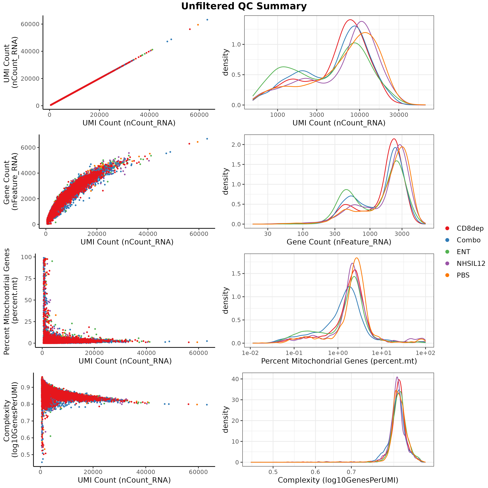
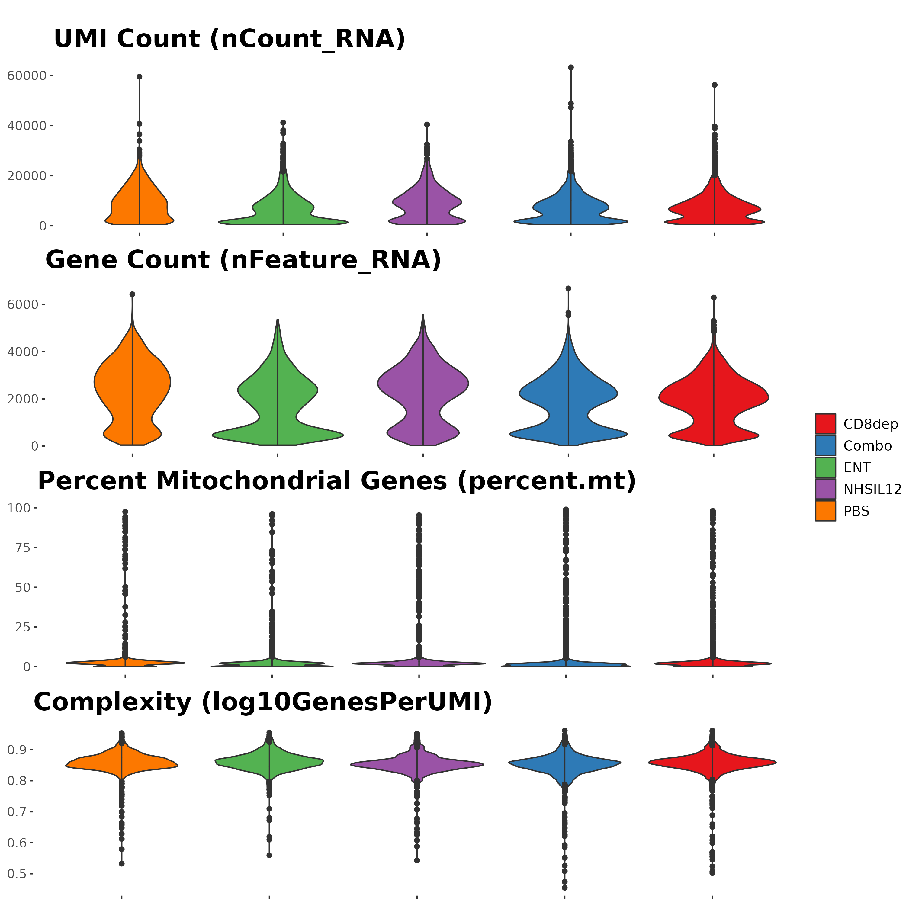
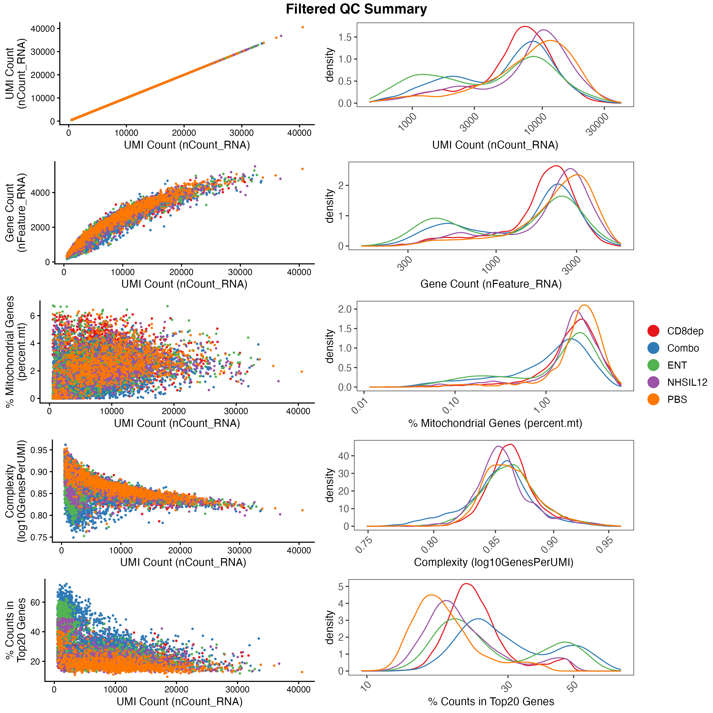
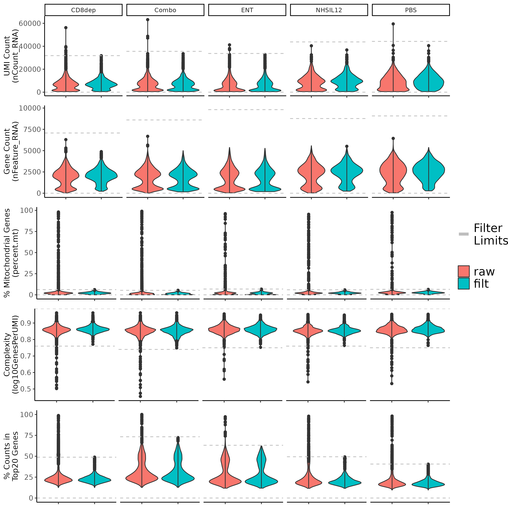
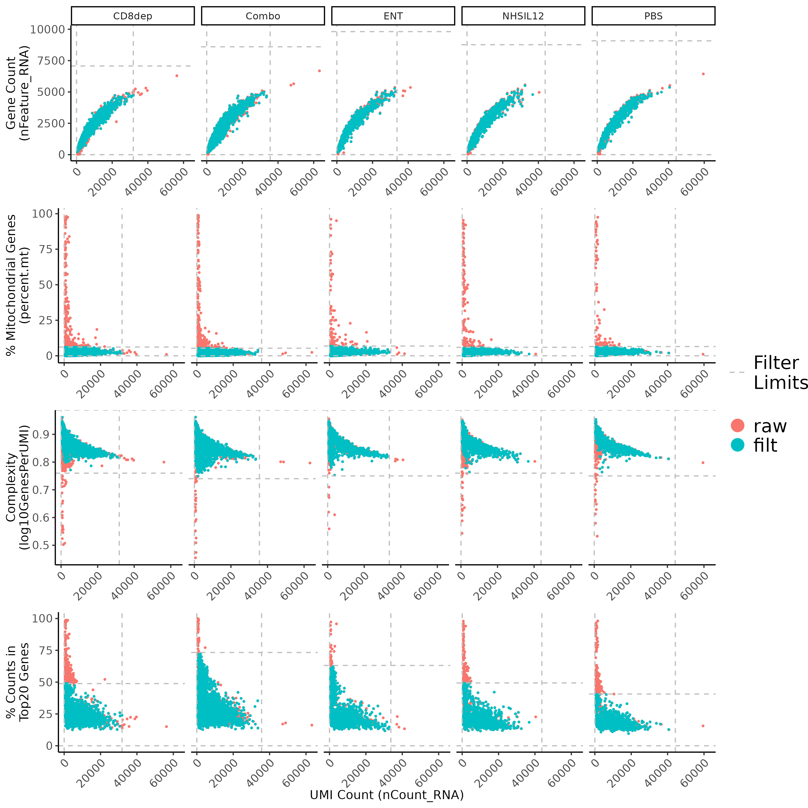
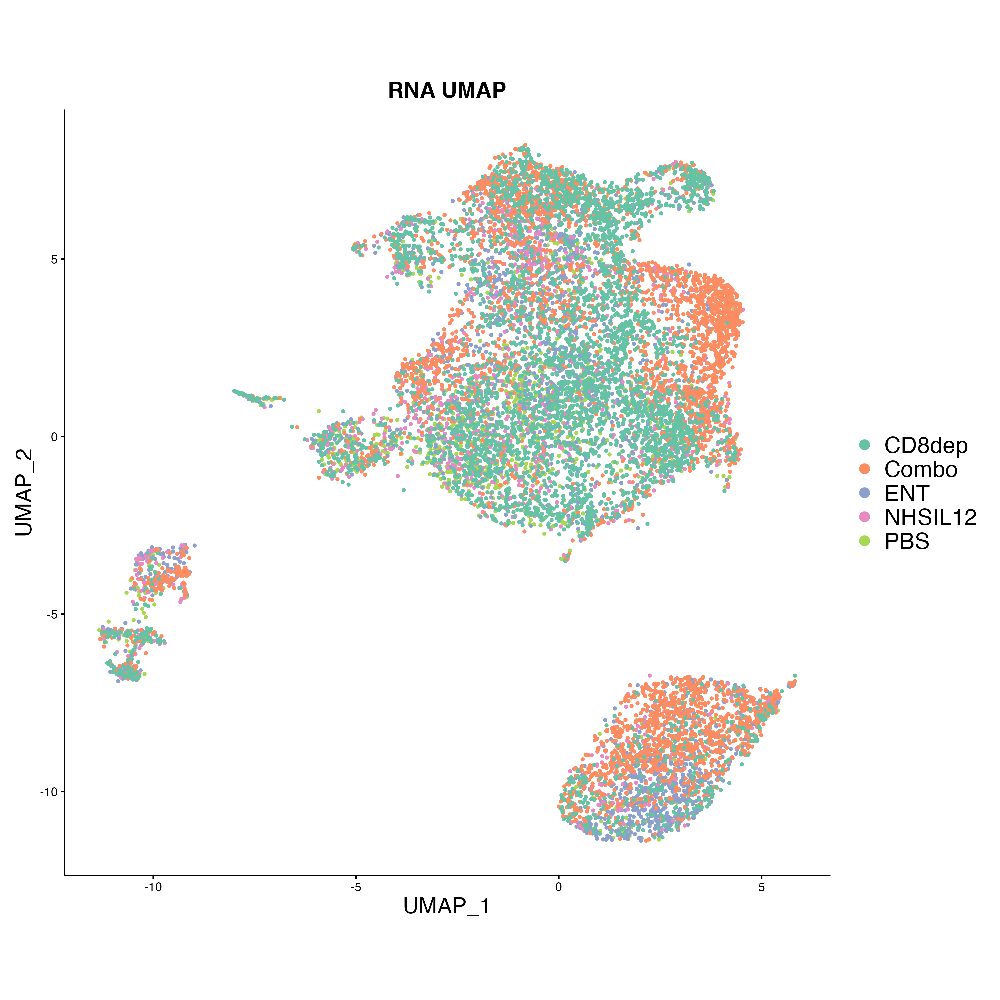
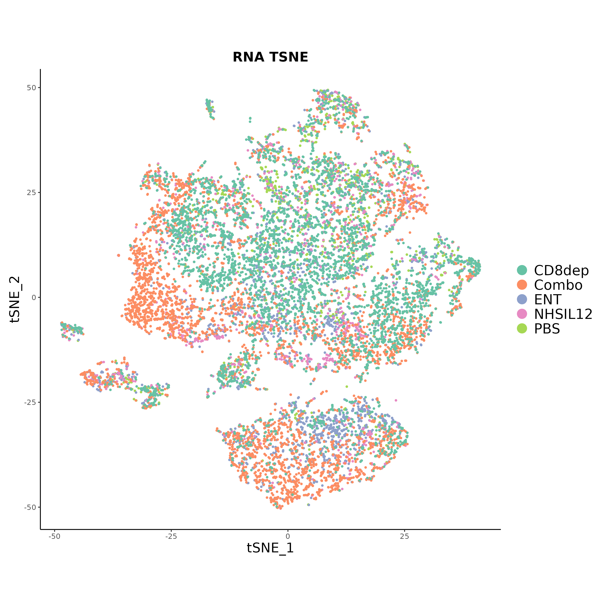

```{r, include = FALSE}
options(rmarkdown.html_vignette.check_title = FALSE)

knitr::opts_chunk$set(
  collapse = TRUE,
  comment = "#>",
  warning = FALSE, message = FALSE
)

library(data.table)
library(dplyr)
library(ggplot2)
```


{width=300}


```{r setup}
# install.packages("remotes")
# remotes::install_github("NIDAP-Community/SCWorkflow", dependencies = TRUE)

library(SCWorkflow)
```

## Process Input Data

This package is designed to work with the general Seurat Workflow[1]. To begin using the SCWorkflow tools you will have to process the h5 files generated by the Cell Ranger[Reference] software from the 10x genomics platform to create a list of Seurat Objects corresponding to each h5 file. A Seurat Object is the basic data structure for Seurat Single Cell analysis

This tool supports standard scRNAseq, CITE-Seq, and TCR-Seq assays. Samples prepared with a cell hashing protocol (HTOs) can also be processed to produce a Seurat Object split by the corresponding experimental design strategy. h5 files containing multiple samples can also be processed to create Seurat objects that will be split based on the values in the orig.ident column. 

A corresponding Metadata table can be used to add sample level information to the Seurat object. The table format should have Sample names in the first Column and any  sample metadata in additional columns. The Metadata table can also be used to rename samples by including an alternative sample name Column in the metadata table.

```{r,echo=F}
# data.table(My_Sample_Names=c('CID3586','CID3921',
#                              'CID4066','CID4290A',
#                              'CID4398','CID4471',
#                              'CID4495','CID44971',
#                              'CID44991'),
#            New_Names=c('H1','H2','H3',
#                        'E1','E2','E3',
#                        'T1','T2','T3'),
#            Subtype=c('HER2','HER2','HER2',
#                      'ER','ER','ER',
#                      'TNBC','TNBC','TNBC'))%>%
#   head()%>%knitr::kable()

SampleMetadataTable=data.table(Sample_Name=c('SCAF1713_1_1','SCAF1714_2_1','SCAF1715_3_1',
                                'SCAF1716_4_1','SCAF1717_5_1'),
                 Rename=c("PBS","ENT","NHSIL12","Combo","CD8dep"),
                Treatment=c('WT',"Entinostat","NHS-IL12","Entinostat + NHS-IL12",'Entinostat + NHS-IL12'))
write.table(SampleMetadataTable,
            file = "./images/Sample_Metadata.txt",
            sep = '\t',
            row.names = F)
  SampleMetadataTable%>%knitr::kable()
        

```

Samples can also be excluded from the final Seurat object using a REGEX strategy to identify the samples to be included/excluded. explain based on newnames

The final Seurat Object will contain an assay slot with log2 normalized counts. QC figures for individual samples will also be produced to help evaluate samples quality.

```{r,eval=F,echo=T,results='hide'}

SampleMetadataTable <- read.table(file = "./images/Sample_Metadata.txt",  sep = '\t',header = T)
files=list.files(path="../tests/testthat/fixtures/Chariou/h5files",full.names = T)

SOlist=processRawData(input=files,
               organism="Mouse",
               sample.metadata.table=SampleMetadataTable,
               sample.name.column='Sample_Name',
               rename.col='Rename',
               keep=T,
               file.filter.regex=c(),
               split.h5=F,
               cell.hash=F,
               do.normalize.data=T                
)
```

```{r,echo=F,eval=F}
ggsave(SOlist$plots[[1]], filename = "./images/ProcessInputData1.png", width = 10, height = 10)
ggsave(SOlist$plots[[2]], filename = "./images/ProcessInputData2.png", width = 10, height = 10)

```

{width=300} {width=300}

1. Hao Y et al. Integrated analysis of multimodal single-cell data. Cell. 2021 Jun 24;184(13):3573-3587.e29. doi: 10.1016/j.cell.2021.04.048. Epub 2021 May 31. PMID: 34062119; PMCID: PMC8238499.


## Filter Low Quality Cells

This function will filter genes and cells based on multiple metrics available in the Seurat Object metadata slot. A detailed guide for single cell quality filtering can be found from Xi and Li, 2021 [2].
First, genes can be filtered by setting the minimum number of cells needed to keep a gene or removing VDJ Add descriptiopn of VDJ genes. Next, cells can be filtered by setting thresholds for each individual metric. Cells that do not meet any of the designated criteria will be removed from the final filtered Seurat Object . Filter limits can be set by using absolute values or median absolute deviations (MADs) for each criteria. If both absolute and MAD values are set for a single filter, the least extreme value (i.e. the lowest value for upper limits or the highest value for lower limits) will be selected. The filter values used for each metric will be printed in the log output. All filters have default values and can be turned off by setting limits to NA. 

The individual filtering criteria used in this tool are listed below.
  
  1. The total number of molecules detected within each cell (nCount_RNA)
  2. The number of genes detected in each cell (nFeature_RNA)
  3. The complexity of of genes ( log10(nFeature_RNA)/log10(nCount_RNA)
  4. Percent of mitochondrial Genes
  5. Percent counts in top 20 Genes
  6. Doublets calculated by scDblFinder (using package default parameters) [3]


The function will return a filtered Seurat Object and various figures showing metrics before and after filtering. These figures can be used to help evaluate the effects of filtering criteria and whether filtering limits need to be adjusted. 


```{r,eval=F,echo=T,results='hide'}

SO_filtered=filterQC(object=SOlist$object,
                     ## Filter Genes
                     min.cells = 20,
                     filter.vdj.genes=F,
                     
                     ## Filter Cells
                     nfeature.limits=c(NA,NA),
                     mad.nfeature.limits=c(5,5),
                     ncounts.limits=c(NA,NA),
                     mad.ncounts.limits=c(5,5),
                     mitoch.limits = c(NA,25),
                     mad.mitoch.limits = c(NA,3),
                     complexity.limits = c(NA,NA),
                     mad.complexity.limits = c(5,NA),
                     topNgenes.limits = c(NA,NA),
                     mad.topNgenes.limits = c(5,5),
                     n.topgnes=20,
                     do.doublets.fitler=T
                                 
            )


```

```{r,echo=F,eval=F}
ggsave(SO_filtered$plots$PostFilterCombined, filename = "./images/QC1.png", width = 10, height = 10)
ggsave(SO_filtered$plots$ViolinPlotCombine, filename = "./images/QC2.png", width = 10, height = 10)
ggsave(SO_filtered$plots$ScatterPlotCombine, filename = "./images/QC3.png", width = 10, height = 10)

```

{width=300} {width=300}

{width=300}


2. Heumos, L., Schaar, A.C., Lance, C. et al. Best practices for single-cell analysis across modalities. Nat Rev Genet (2023). https://doi.org/10.1038/s41576-023-00586-w

3. Germain P, Lun A, Macnair W, Robinson M (2021). “Doublet identification in single-cell sequencing data using scDblFinder.” f1000research. doi:10.12688/f1000research.73600.1.

## Combine, Normalize, and Cluster Data

This functions combines multiple sample level Seurat Objects into a single Seurat Object and normalizes the combined dataset. The multi-dimensionality of the data will be summarized into a set of "principal components" and visualized in both UMAP and tSNE projections.  A graph-based clustering approach will identify cell clusters with in the data.

```{r,eval=F,echo=T,results='hide'}

Comb_SO=combineNormalize(
                         object=SO_filtered$object,
                     # Nomralization variables
                         npcs = 21,
                         SCT.level="Merged",
                         vars.to.regress = c("percent.mt"),
                     # FindVariableFeatures
                         nfeatures = 2000,
                         low.cut = 0.1,
                         high.cut = 8,
                         low.cut.disp = 1,
                         high.cut.disp = 100000,
                         selection.method = 'vst',
                     # Dim Reduction
                         only.var.genes = FALSE,
                         draw.umap = TRUE,
                         draw.tsne = TRUE,
                         seed.for.pca = 42,
                         seed.for.tsne = 1,
                         seed.for.umap = 42,
                    # Clustering Varables
                         clust.res.low = 0.2,
                         clust.res.high = 1.2,
                         clust.res.bin = 0.2,
                    # Select PCs
                         methods.pca = NULL,
                         var.threshold = 0.1,
                         pca.reg.plot = FALSE,
                         jackstraw = FALSE,
                         jackstraw.dims=5,
                    # Other                         
                         exclude.sample = NULL,
                         cell.count.limit= 35000,
                         reduce.so = FALSE,
                         project.name = 'scRNAProject',
                         cell.hashing.data = FALSE
)


```

```{r,echo=F,eval=F}
saveRDS(Comb_SO$object, file="./images/CN_SO.rds")

ggsave(Comb_SO$plots$UMAP, filename = "./images/CN1.png", width = 10, height = 10)
ggsave(Comb_SO$plots$TSNE, filename = "./images/CN2.png", width = 10, height = 10)

```

{width=300} {width=300}

