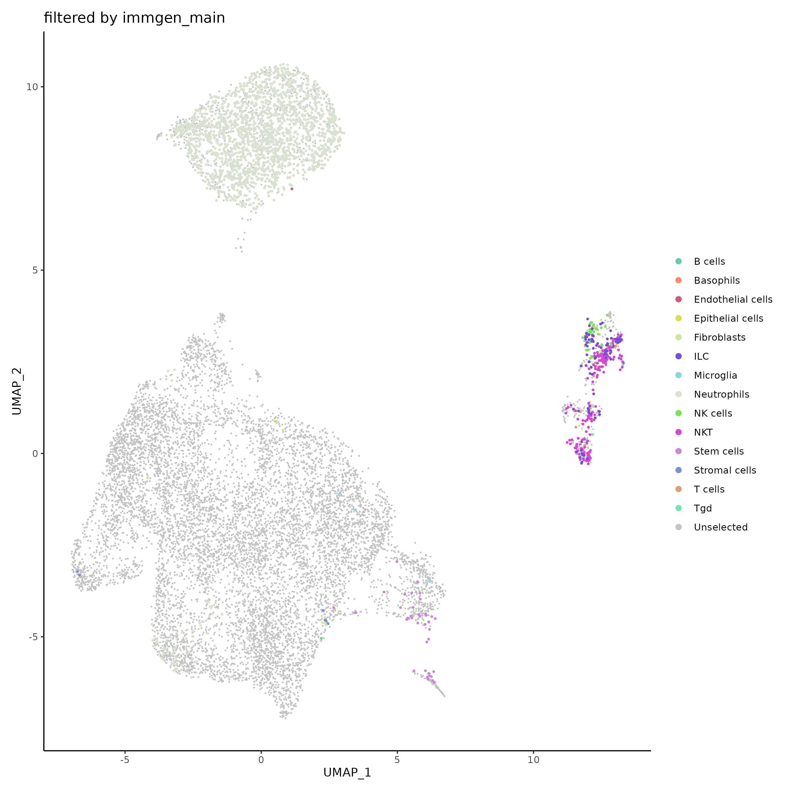
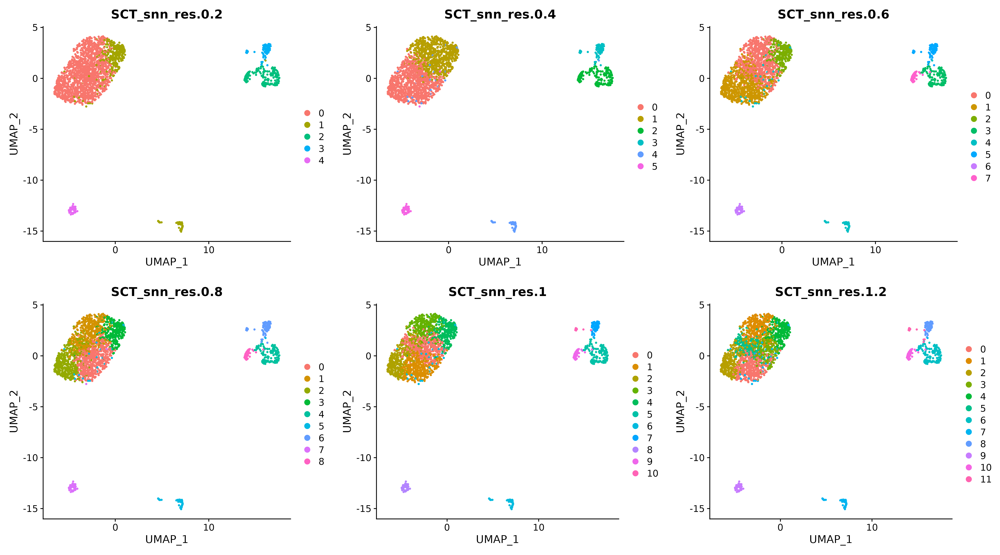

---
title: "Subset and Recluster"
output: rmarkdown::html_vignette
vignette: >
  %\VignetteIndexEntry{SCWorkflow-SubsetReclust}
  %\VignetteEngine{knitr::rmarkdown}
  %\VignetteEncoding{UTF-8}

---

```{r, include = FALSE}
options(rmarkdown.html_vignette.check_title = FALSE)

knitr::opts_chunk$set(
  collapse = TRUE,
  comment = "#>",
  warning = FALSE, message = FALSE
)

library(data.table)
library(dplyr)
library(ggplot2)
run_Chunks=F
```

```{r,include=F,echo=F,eval=run_Chunks}

Anno_SO=readRDS("./images/Anno_SO.rds")

```

<br>


## Subset Seurat Object

---

This  function subsets your Seurat object. Select a metadata column and values matching the cells to pass forward in your analysis. 

```{r,eval=run_Chunks}

filter_SO=filterSeuratObjectByMetadata(
                   object = Anno_SO$object,
                   samples.to.include = c("PBS","ENT","NHSIL12","Combo","CD8dep"),
                   sample.name = "orig.ident",
                   category.to.filter = "immgen_main",
                   values.to.filter = c("Monocytes","Macrophages","DC"),
                   keep.or.remove = FALSE,
                   greater.less.than = "greater than",
                   colors = c(
                     "aquamarine3",
                     "salmon1",
                     "lightskyblue3"),
                   seed = 10,
                   cut.off = 0.5,
                   legend.position = "right",
                   reduction = "umap",
                   plot.as.interactive.plot = FALSE,
                   legend.symbol.size = 2,
                   dot.size = 0.1,
                   number.of.legend.columns = 1,
                   dot.size.highlighted.cells = 0.5,
                   use.cite.seq.data = FALSE
                  ) 

```

```{r,echo=F,eval=run_Chunks}
saveRDS(filter_SO, file="./images/filter_SO.rds")

ggsave(filter_SO$plots$plot1, filename = "./images/SubRec_sub1.png", width = 10, height = 10)
ggsave(filter_SO$plots$plot2, filename = "./images/SubRec_sub2.png", width = 10, height = 10)

```

{width=300}

<br>

## Recluster Seurat Object

---


This  function provides a mechanism for re-clustering a filtered Seurat object, a common task in single-cell RNA sequencing analysis. The  function provides options to choose the number of principal components, range of clustering resolution, type of dimensionality reduction, and several other parameters.
The  function finds variable features and performs Principal Component Analysis (PCA). Next, dimensionality reduction is performed using UMAP and t-SNE based on PCA, followed by identification of nearest neighbors. It then performs clustering at different resolutions within the provided range, creating new clustering columns in the Seurat object. It also retains the old clustering information, plots the clusters for each resolution and returns a list containing the re-clustered Seurat object and the grid of clustering plots.
This  function can be helpful for experimenting with different clustering parameters especially after filtering and visually inspect the results.

**Methodology**  
This  function uses methods from the Seurat package [1].  
Seurat uses a graph-based clustering method inspired by previous strategies, particularly those of Macosko et al [3]. It uses methods like SNN-Cliq and PhenoGraph [4.5], which represent cells in a graph structure based on similarities in feature expression patterns. The aim is to divide this graph into highly connected communities or clusters.
The process begins by building a K-nearest neighbor (KNN) graph using Euclidean distance in PCA space. The algorithm refines the edge weights between cells according to their local neighborhood overlap, calculated using the Jaccard similarity measure. This is performed using predefined dimensions of the dataset, such as the first 10 Principal Components (PCs).
To cluster cells, Seurat uses modularity optimization techniques like the Louvain [4] algorithm or SLM [5]. The 'resolution' parameter can be adjusted to control the granularity of the downstream clustering; a higher resolution results in more clusters. For single-cell datasets of approximately 3K cells, the recommended range for this parameter is between 0.4 and 1.2, but larger datasets typically require a higher resolution.

```{r,eval=F}

reClust_SO=reclusterSeuratObject(
                  object = filter_SO$object,
                  prepend.txt = "old",
                  old.columns.to.save=c("orig_ident","Sample_Name","nCount_RNA","nFeature_RNA","percent_mt",
                                        "log10GenesPerUMI","S_Score","G2M_Score","Phase","CC_Difference","Treatment",
                                        "pct_counts_in_top_N_genes","Doublet","nCount_SCT","nFeature_SCT",
                                        "mouseRNAseq_main","mouseRNAseq","immgen_main","immgen" ),
                  number.of.pcs = 50,
                  cluster.resolution.low.range = 0.2,
                  cluster.resolution.high.range = 1.2,
                  cluster.resolution.range.bins = 0.2,
                  reduction.type = "umap"
                              )

```

```{r,echo=F,eval=run_Chunks}
saveRDS(reClust_SO, file="./images/reClust_SO.rds")

ggsave(reClust_SO$plots, filename = "./images/SubRec_recl.png", width = 18, height = 10)

```

{width=600}
   
<br><br>    
   
1. Seurat Clustering method https://satijalab.org/seurat/articles/pbmc3k_tutorial.html
 
3. Macosko EZ, Basu A, Satija R, Nemesh J, Shekhar K, Goldman M, Tirosh I, Bialas AR, Kamitaki N, Martersteck EM, Trombetta JJ, Weitz DA, Sanes JR, Shalek AK, Regev A, McCarroll SA. Highly Parallel Genome-wide Expression Profiling of Individual Cells Using Nanoliter Droplets. Cell. 2015 May 21;161(5):1202-1214.

4. Xu, Chen, and Zhengchang Su. Identification of cell types from single-cell transcriptomes using a novel clustering method. Bioinformatics 31.12 (2015): 1974-1980.

5. Levine, Jacob H., et al. Data-driven phenotypic dissection of AML reveals progenitor-like cells that correlate with prognosis. Cell 162.1 (2015): 184-197.

6. Blondel, Vincent D., et al. Fast unfolding of communities in large networks."Journal of statistical mechanics: theory and experiment 2008.10 (2008): P10008.

7. Waltman, Ludo, and Nees Jan Van Eck. A smart local moving algorithm for large-scale modularity-based community detection. The European physical journal B 86 (2013): 1-14


