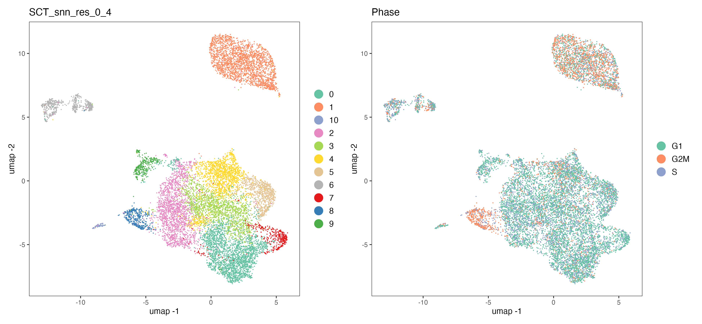
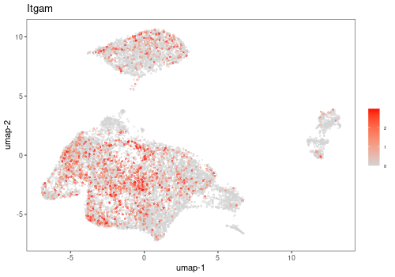
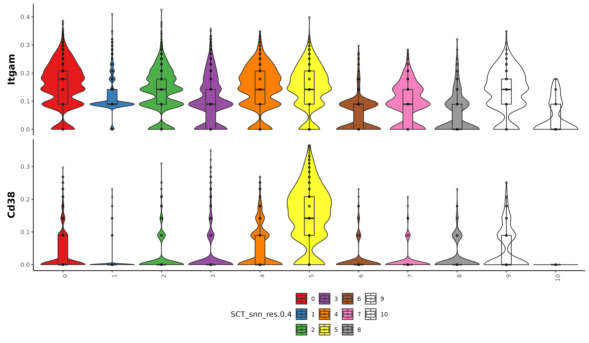
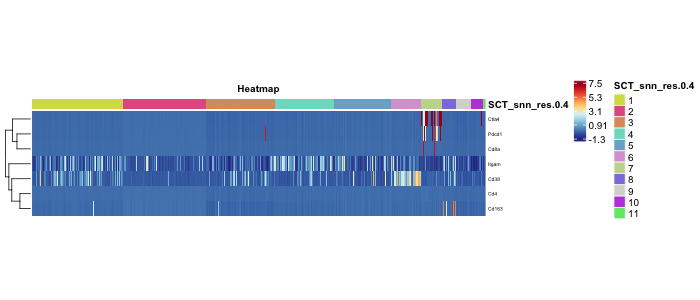
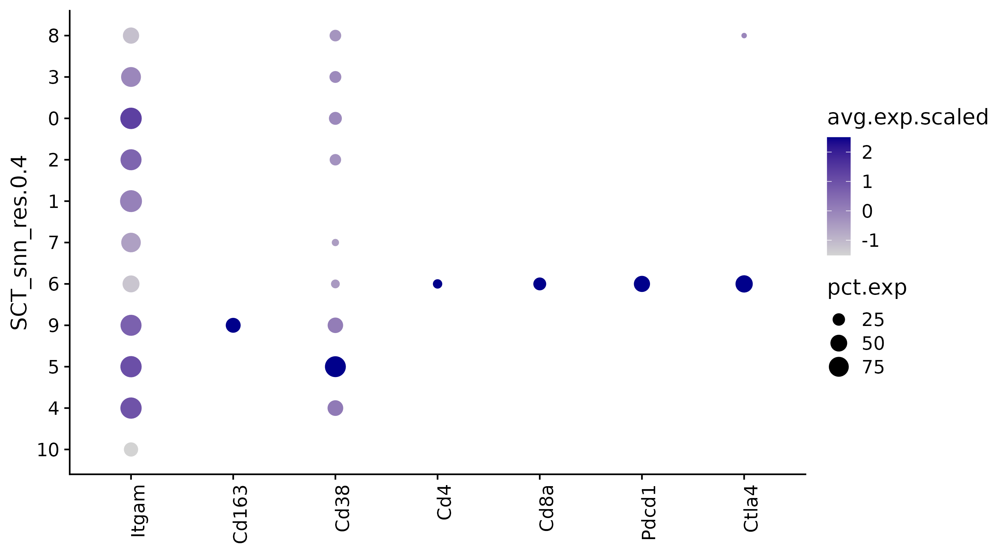
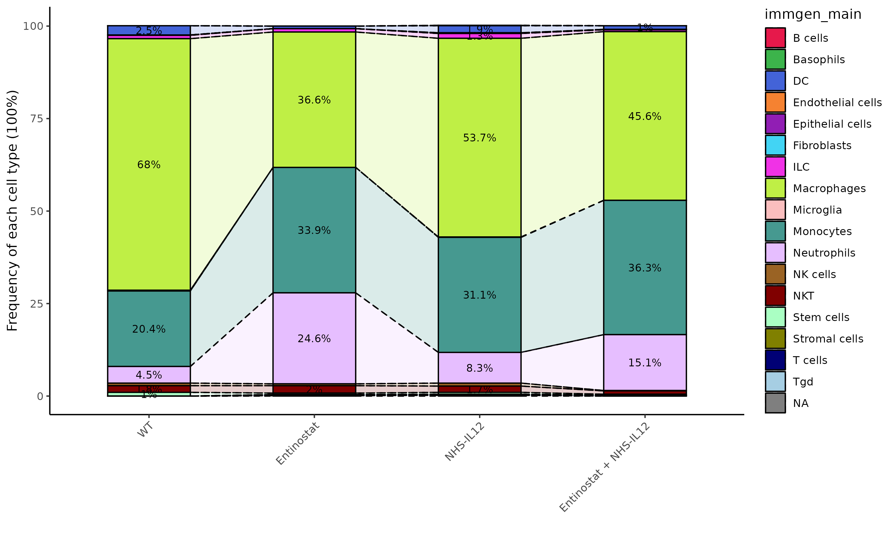

---
title: "Visualizations"
output: rmarkdown::html_vignette
vignette: >
  %\VignetteIndexEntry{SCWorkflow-Visualizations}
  %\VignetteEngine{knitr::rmarkdown}
  %\VignetteEncoding{UTF-8}

---

```{r, include = FALSE}
options(rmarkdown.html_vignette.check_title = FALSE)

knitr::opts_chunk$set(
  collapse = TRUE,
  comment = "#>",
  warning = FALSE, message = FALSE
)

library(data.table)
library(dplyr)
library(ggplot2)

run_Chunks=F
```

```{r,include=F,echo=F,eval=run_Chunks}

Anno_SO=readRDS("./images/Anno_SO.rds")

```

<br>

## Color by Metadata

---

Use this Function to color your dimensionality reduction (TSNE & UMAP) with different columns from your Metadata Table. You can select one or more columns from the Metadata Table, and for each column selected, this function will produce a plot (t-SNE & UMAP) using the data in that column to color the cells. 

This function visualizes your plot based on selected metadata. Users can customize how they want to visualize the data, including the type of visualization used, the size and shape of the points, and the level of transparency. 

```{r,eval=run_Chunks}
FigOut=plotMetadata(
            object=Anno_SO$object,
            samples.to.include=c("PBS","ENT","NHSIL12","Combo","CD8dep" ),
            metadata.to.plot=c('SCT_snn_res.0.4','Phase'),
            columns.to.summarize=NULL,
            summarization.cut.off = 5,
            reduction.type = "umap",
            use.cite.seq = FALSE,
            show.labels = FALSE,
            legend.text.size = 1,
            legend.position = "right",
            dot.size = 0.01
                  )
```
```{r,eval=run_Chunks,echo=F,results='hide'}
p=FigOut$plots[[1]]+FigOut$plots[[2]]
ggsave(p, filename = "./images/Vis_CBM.png", width = 13, height = 6)

```

{width=600} 

<br>

## Plot 3D Dimensionality Reduction

---

This Function creates 3D interactive UMAP or t-SNE plot. The plot is saved in the output folder as an HTML file that can be downloaded. 

This function is designed to generate a 3D t-SNE visualization based on a given Seurat Object. The output includes an interactive plot and a dataframe containing the t-SNE coordinates. The function accepts several parameters, such as the Seurat Object, a metadata column for color, a metadata column for labeling, dot size for the plot, legend display option, colors for the color variable, filename for saving the plot, the number of principal components for t-SNE calculations, and an option to save the plot as a widget in an HTML file.
Initially, the function executes t-SNE on the Seurat Object to obtain the 3D coordinates. Subsequently, it constructs a dataframe for the Plotly visualization, incorporating the t-SNE coordinates, color variable, and label variable. The function generates a 3D scatter plot using the t-SNE coordinates. Finally, the function saves the plot as an embedded Plotly image in an HTML file.

**Methodology**  
t-Distributed Stochastic Neighbor Embedding (t-SNE) is a sophisticated dimensionality reduction technique frequently employed for the visualization of high-dimensional data [1]. It effectively displays the relationships between individual cells based on their gene expression profiles.
To compute t-SNE, the algorithm constructs a probability distribution representing similarities between data points in high-dimensional space. Subsequently, it generates a lower-dimensional representation, typically two or three dimensions, wherein the distances between data points reflect their similarities in the high-dimensional space.
The algorithm employs an iterative process to adjust the positions of cells in a lower-dimensional space, aiming to minimize discrepancies between the original high-dimensional similarities and those in the lower-dimensional space. This approach enables the algorithm to capture both global and local structures within the data, effectively revealing clusters or groups of similar cells.

```{r,eval=run_Chunks}

FigOut=tSNE3D(
           object=Anno_SO$object,
           color.variable='SCT_snn_res.0.4',
           label.variable='SCT_snn_res.0.4',
           dot.size = 4,
           legend = TRUE,
           colors = c("darkblue","purple4","green","red","darkcyan",
                      "magenta2","orange","yellow","black"),
           filename = "plot.html",
           save.plot = FALSE,
           npcs = 15
           )

```

```{r,eval=run_Chunks,echo=F,results='hide'}

# saveRDS(FigOut$plot,"./images/Vis_3D.rds")

saveWidget(as_widget(FigOut$plots), file = "./images/Vis_3D.html")
```

```{r,eval=T,echo=F,out.width="100%",results='hide',include=F}
library(rvest)
library(htmltools)
# readRDS("./images/Vis_3D.rds")
# htmltools::includeHTML('./images/Vis_3D.html')
# shiny::includeHTML('./images/Vis_3D.html')

html_content <- read_html('./images/Vis_3D.html')
print(html_content)
```


<br>

## Color by Genes

---

This function visualizes gene expression intensities for provided Genes across your cells. If a gene is not found in the dataset, the Log will report this. Otherwise, you should see one plot (TSNE or UMAP, your choice) per gene name provided. The intensity of the red color will be relative to the expression of the gene in that cell. Final Potomac Compatible Version: v98. Sugarloaf V1: v103. [View 

**Methodology**  
This function visualizes expression values of the chosen gene or protein in different samples. Users can customize how they want to visualize the data, including the type of visualization used, the size and shape of the points, and the level of transparency. 

```{r,eval=run_Chunks}

FigOut=colorByGene(
            object=Anno_SO$object,
            samples.to.include=c("PBS","ENT","NHSIL12","Combo","CD8dep" ),
            gene='Itgam',
            reduction.type = "umap",
            number.of.rows = 0,
            return.seurat.object = FALSE,
            color = "red",
            point.size = 1,
            point.shape = 16,
            point.transparency = 0.5,
            use.cite.seq.data = FALSE,
            assay = "SCT")

```

```{r,eval=run_Chunks,echo=F,results='hide'}

# ggsave(FigOut$plot, filename = "./images/Vis_CBG.png", width = 10, height = 10)

png(filename="./images/Vis_CBG.png",width = 500,height = 350,pointsize = 10)
(FigOut$plots)
dev.off()

```
{width=300} 

<br>

## Violin Plot from Seurat Object

---

This Function allows for the generation of customized violin plots to visualize transcriptional changes and interactions in single-cell RNA-seq data, providing insights into the cellular heterogeneity and dynamics within the dataset.

**Methodology**  
The Function organizes your data based on specific groups that you choose from a Seurat Object metadata. It then gathers information about the activity levels of specific genes you're interested in.
You can, if you wish, change the names or the order of these groups based on a column you specify in the data. This feature lets you tailor the analysis more closely to your needs.
The code also has a function that removes any odd data points that might distort the results, and it adjusts the data to make it easier to visualize through jittered points and an overlaying boxplot displaying quantile information.
Then, the code creates violin plots, which allows you to see how the activity levels of genes vary within each group [2]. The graph is customizable, letting you set various options such as limit values on the vertical axis, displaying individual data points, converting scales to logarithmic, and showing boxplots.
You can choose how the plot looks - whether it's laid out like a grid, in rows, or with customized labels.

```{r,eval=run_Chunks}

FigOut=violinPlot_mod(
                object=Anno_SO$object, 
                assay='SCT', 
                slot='scale.data', 
                genes=c('Cd163','Cd38'), 
                group='SCT_snn_res.0.4', 
                facet_by = "", 
                filter_outliers = F,
                outlier_low = 0.05,
                outlier_high = 0.95,
                jitter_points = TRUE, 
                jitter_dot_size = 1
          )

```
```{r,eval=run_Chunks,echo=F,results='hide'}

ggsave(FigOut$plots, filename = "./images/Vis_Violin.png", width = 12, height = 5)

# png(filename="./images/Vis_Violin.png",width = 500,height = 350,pointsize = 10)
# (FigOut$plot)
# dev.off()

```

{width=600} 

<br>

## Heatmap

---

This Function provides a comprehensive method for visualizing single cell transcript and/or protein expression data in the form of a heatmap. The data is obtained from a Seurat object, and the user can specify a set of genes for the analysis.  
The Function allows optional ordering by metadata (categorical) or gene/protein expression levels. Visualization customization options include color choices for the heatmap, addition of gene or protein annotations, and optional arrangement by metadata. 

Key features include:
- Options for adding gene or protein annotations, metadata arrangement, and specifying row and column names.
- Customizable visualization settings including font sizes for rows, columns, and legend, row height, and heatmap colors.
- Ability to trim outlier data, perform z-scaling on rows, and set row order.

The Function returns a heatmap plot along with the underlying data used to generate it. It also allows the user to set a seed for color generation and specify outlier data parameters. This function is particularly useful for exploratory data analysis and preliminary data visualization in single cell studies.

**Methodology**  
In this method, two hierarchical clustering processes are performed: one on the rows and one on the columns of the dataset unless ordered by annotations. Hierarchical clustering is a method of cluster analysis that aims to build a hierarchy of clusters. The result is a tree-like diagram called a dendrogram, where similar data points (e.g., genes or samples) are joined together into clusters at the "branches", based on a mathematical measure of similarity such as Euclidean or Manhattan distance.
The heatmap is produced by a package called ComplexHeatmap [3] and presents the data matrix where rows represent individual genes (or proteins, metabolites, etc.) and columns represent different samples (e.g., tissue samples, cells, experimental conditions). The color at each position in the grid corresponds to the expression level of a gene in a particular sample, with one color representing upregulation (higher expression), another representing downregulation (lower expression), and usually a neutral color representing no change. This allows for easy visual interpretation of patterns or correlations in the data.

```{r,eval=run_Chunks}

FigOut=heatmapSC(
          object=Anno_SO$object,
          sample.names=c("PBS","ENT","NHSIL12","Combo","CD8dep" ),
          metadata='SCT_snn_res.0.4',
          transcripts=c('Cd163','Cd38','Itgam','Cd4','Cd8a','Pdcd1','Ctla4'),
          use_assay = 'SCT',
          proteins = NULL,
          heatmap.color = "Bu Yl Rd",
          plot.title = "Heatmap",
          add.gene.or.protein = FALSE,
          protein.annotations = NULL,
          rna.annotations = NULL,
          arrange.by.metadata = TRUE,
          add.row.names = TRUE,
          add.column.names = FALSE,
          row.font = 5,
          col.font = 5,
          legend.font = 5,
          row.height = 15,
          set.seed = 6,
          scale.data = TRUE,
          trim.outliers = TRUE,
          trim.outliers.percentage = 0.01,
          order.heatmap.rows = FALSE,
          row.order = c()
          )

```
```{r,eval=run_Chunks,echo=F,results='hide'}

# ggsave(FigOut$plot, filename = "./images/Vis_HM.png", width = 12, height = 5)

png(filename="./images/Vis_HM.png",width = 700,height = 300,pointsize = 10)
(FigOut$plots)
dev.off()

```

{width=600} 

<br>

## Dot Plot of Genes by Metadata

---

This function creates a dot plot of average gene expression values for a set of genes in cell subpopulations defined by metadata annotation columns.  The input table contains a single column for genes (the "Genes column") and a single column for category (the "Category labels to plot" column).  The values in the "Category labels to plot" column should match the values provided in the metadata function (Metadata Category to Plot).  The plot will order the genes (x-axis, left to right) and Categories (y-axis, top to bottom) in the order in which it appears in the input table.  Any category entries omitted will not be plotted.  

The Dotplot size will reflect the percentage of cells expressing the gene while the color will reflect the average expression for the gene.  A table showing values on the plot (either percentage of cells expressing gene, or average expression scaled) will be returned, as selected by user. 

**Methodology**    
This function creates a dot plot visualization of gene expression by metadata from a given dataset. It uses the Seurat package to create these plots. The size of the dot represents the percentage of cells expressing a particular gene (frequency), while the color of the dot indicates the average gene expression level.
The function ensures that only unique and valid genes and categories are used. If some categories or genes are not found in the dataset, appropriate warnings are issued.  The plot is then drawn with the option to reverse the x and y-axes and to reverse the order of metadata categories. The colors can also be customized.
In addition to the plot, the function provides the tabular format of the dot plot data, which can be useful for further analysis or reporting.  A choice of returning either the tables representing the percent of cells expressing a gene or the average expression level of the genes.
This function can be useful for exploratory data analysis and visualizing the differences in gene expression across different conditions or groups of cells.

1. Seurat package Dotplot Documentation https://satijalab.org/seurat/reference/dotplot


```{r,eval=run_Chunks}

FigOut=dotPlotMet(
           object=Anno_SO$object,
           metadata='SCT_snn_res.0.4',
           cells=unique(Anno_SO$object$SCT_snn_res.0.4),
           markers=c('Itgam','Cd163','Cd38','Cd4','Cd8a','Pdcd1','Ctla4'),
           plot.reverse = FALSE,
           cell.reverse.sort = FALSE,
           dot.color = "darkblue"
           )

```
```{r,eval=run_Chunks,echo=F,results='hide'}

ggsave(FigOut$plots, filename = "./images/Vis_DPM.png", width = 9, height = 5)

# png(filename="./images/Vis_HM.png",width = 700,height = 300,pointsize = 10)
# (FigOut$plot)
# dev.off()

```

{width=500} 

<br>

## Compare Cell Populations

---


```{r,eval=run_Chunks}

FigOut=compareCellPopulations(
            object=Anno_SO$object,
            metadata.table=Anno_SO$object@meta.data,
            annotation.column='immgen_main',
            group.column='Treatment',
            counts.type = "Frequency",
            group.order = NULL,
            wrap.ncols = 5
)
 
```

```{r,eval=run_Chunks,echo=F,results='hide'}

ggsave(FigOut$Plots$Barplot, filename = "./images/Vis_CCPbar.png", width = 9, height = 10)

# png(filename="./images/Vis_HM.png",width = 700,height = 300,pointsize = 10)
# (FigOut$plot)
# dev.off()
```

{width=500}

<br> 

<!-- ## Trajectory Analysis with TSCAN -->

<!-- Application of TSCAN Trajectory Analysis method to preClustered Seurat Object. -->

<!-- This template is a Beta version and is undergoing active development. If you encounter problems, please contact CCBR NCICCBRNIDAP@mail.nih.gov -->


<!-- ```{r,eval=F,echo=F,results='hide'} -->
<!-- ## Part I: Trajectory -->

<!-- Idents(so) <- LABEL -->
<!-- dimplot <- DimPlot(so) -->
<!-- sce <- as.SingleCellExperiment(so) -->
<!-- colLabels(sce) <- colData(sce)[[LABEL]]  -->

<!-- by.cluster <- aggregateAcrossCells(sce, ids=colLabels(sce)) -->
<!-- centroids <- reducedDim(by.cluster, "PCA") -->

<!-- # Set clusters=NULL as we have already aggregated above. -->
<!-- mst <- TSCAN::createClusterMST(centroids, clusters=NULL) -->

<!-- line.data <- reportEdges(by.cluster, mst=mst, clusters=NULL, use.dimred="TSNE") -->
<!-- plot_tsne1 <- plotTSNE(sce, colour_by="label") + geom_line(data=line.data, mapping=aes(x=tSNE_1, y=tSNE_2, group=edge)) -->

<!-- # Lets also try UMAP: -->
<!-- line.data.umap <- reportEdges(by.cluster, mst=mst, clusters=NULL, use.dimred="UMAP") -->
<!-- plot_umap1 <- plotUMAP(sce, colour_by="label") + geom_line(data=line.data.umap, mapping=aes(x=UMAP_1, y=UMAP_2, group=edge)) -->

<!-- map.tscan <- mapCellsToEdges(sce, mst=mst, use.dimred="PCA") -->
<!-- tscan.pseudo <- orderCells(map.tscan, mst) -->
<!-- ##head(tscan.pseudo) -->

<!-- common.pseudo <- averagePseudotime(tscan.pseudo)  -->

<!-- plot_tsne2 <- plotTSNE(sce, colour_by=I(common.pseudo),  -->
<!--                        text_by="label", text_colour="red") + -->
<!--   geom_line(data=line.data, mapping=aes(x=tSNE_1, y=tSNE_2, group=edge)) + -->
<!--   ggtitle("TSCAN-based MST") -->

<!-- plot_umap2 <- plotUMAP(sce, colour_by=I(common.pseudo),  -->
<!--                        text_by="label", text_colour="red") + -->
<!--   geom_line(data=line.data.umap, mapping=aes(x=UMAP_1, y=UMAP_2, group=edge)) + -->
<!--   ggtitle("TSCAN-based MST") -->


<!-- ## Part II: Pseudotime -->

<!-- pseudo.all <- TSCAN::quickPseudotime(sce, use.dimred="PCA") -->
<!-- #head(pseudo.all$ordering) -->


<!-- pseudo.mnn <- TSCAN::quickPseudotime(sce, use.dimred="PCA", with.mnn=TRUE) -->
<!-- mnn.pseudo <- averagePseudotime(pseudo.mnn$ordering) -->
<!-- plot_tsne3 <- plotTSNE(sce, colour_by=I(mnn.pseudo), text_by="label", text_colour="red") + -->
<!--   geom_line(data=pseudo.mnn$connected$TSNE, mapping=aes(x=tSNE_1, y=tSNE_2, group=edge)) + -->
<!--   ggtitle("TSCAN with MNN distances-based MST") -->
<!-- plot_umap3 <- plotUMAP(sce, colour_by=I(mnn.pseudo), text_by="label", text_colour="red") + -->
<!--   geom_line(data=pseudo.mnn$connected$UMAP, mapping=aes(x=UMAP_1, y=UMAP_2, group=edge)) + -->
<!--   ggtitle("TSCAN with MNN distances-based MST") -->


<!-- ## Part III -->
<!-- ### From Chapter 10.3.2, Changes along a trajectory -->
<!-- sce$Pseudotime <- pathStat(tscan.pseudo)[,1] -->
<!-- #sce$TSCAN.first <- pathStat(tscan.pseudo)[,1] -->
<!-- #sce$TSCAN.second <- pathStat(tscan.pseudo)[,2] -->
<!-- pseudo <- TSCAN::testPseudotime(sce, pseudotime=tscan.pseudo[,1])[[1]] -->
<!-- sorted <- pseudo[order(pseudo$p.value),] -->

<!-- up.left <- sorted[sorted$logFC < 0,] -->
<!-- up.left$SYMBOL <- rownames(up.left) -->
<!-- best <- head(up.left$SYMBOL, 10) -->

<!-- TopDecrease <- plotExpression(sce, features=best, x="Pseudotime", colour_by="label", ncol = 5) + ggtitle("Expression of the top 10 genes that decrease in expression with increasing pseudotime") -->

<!-- up.right <- sorted[sorted$logFC > 0,] -->
<!-- up.right$SYMBOL <- rownames(up.right) -->
<!-- best <- head(up.right$SYMBOL, 10) -->
<!-- TopIncrease <- plotExpression(sce, features=best, x="Pseudotime", colour_by="label", ncol = 5) + ggtitle("Expression of the top 10 genes that increase in expression with increasing pseudotime") -->


<!-- on.first.path <- !is.na(sce$Pseudotime) -->
<!-- ``` -->

<!-- ```{r,eval=F,echo=F,results='hide'} -->

<!-- ## Printing Pretty Pics: -->
<!-- print(dimplot) -->

<!-- set.seed(1) -->
<!-- plot(pseudo.all$mst)  -->

<!-- print(plot_tsne1) -->
<!-- grid.arrange(plot_tsne2, plot_tsne3, ncol = 2) -->

<!-- print(plot_umap1) -->
<!-- grid.arrange(plot_umap2, plot_umap3, ncol = 2) -->

<!-- plot(TopDecrease) -->
<!-- plot(TopIncrease) -->
<!-- plotHeatmap(sce[,on.first.path], order_columns_by="Pseudotime", colour_columns_by="label", features=head(up.right$SYMBOL, 50), center=TRUE, main="Expression of the top 50 genes that increase in expression with increasing pseudotime") -->
<!-- plotHeatmap(sce[,on.first.path], order_columns_by="Pseudotime", colour_columns_by="label", features=head(up.left$SYMBOL, 50), center=TRUE, main="Expression of the top 50 genes that decrease in expression with increasing pseudotime") -->


<!-- if(length(custom_gene_list) > 0) -->
<!--    { -->
<!--      CustomScatter <- plotExpression(sce, features=custom_gene_list, x="Pseudotime", colour_by="label", ncol = 5) +  -->
<!--           ggtitle("Expression of genes with increasing pseudotime") -->
<!--      plot(CustomScatter) -->

<!--      plotHeatmap(sce[,on.first.path], -->
<!--           order_columns_by="Pseudotime", -->
<!--           colour_columns_by="label", -->
<!--           features=custom_gene_list, -->
<!--           center=TRUE, -->
<!--           main="Expression of genes with increasing pseudotime") -->
<!--    } -->

<!-- ``` -->

<br><br>

1. Seurat Documentation for t-SNE Analysis  https://satijalab.org/seurat/reference/runtsne

2. https://ggplot2.tidyverse.org/reference/

3. Complex Heatmap Reference Book https://jokergoo.github.io/ComplexHeatmap-reference/book/
